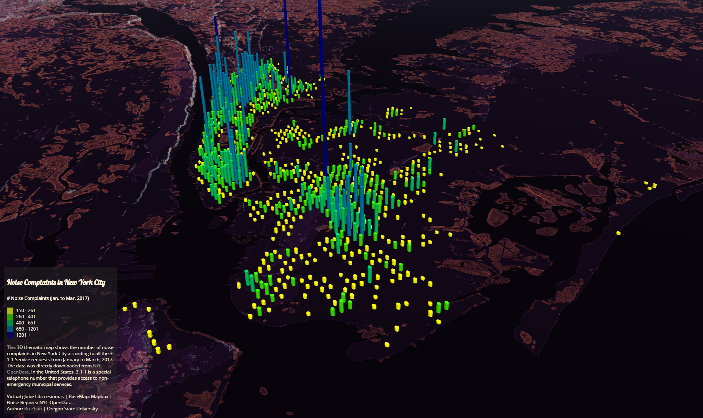

Lab 6

In this lab we manipulated the colors and basemaps used to display noise complaint data in the New york city in a 3-D map in order to understand the abilities of 3-D maps

3-D maps

The utility of a 3-D Map must be balanced with some of its limitations when it comes to deciding whether or not to employ it. Loading a 3-D maps seems far more cpu intensive and I had the map fail a few times while I was playing around with this so the risk of having a map with less usability has to be compared to the positive aspects of the map such as having an additional dimension to display information. I feel that I wouldn’t want to use a 3-D map for any kind of application that might have intended uses on a mobile device because I feel that navigating the additional dimension with less than a mouse and keyboard could prove to be very difficult. On top of that I feel that mobile devices that must get their server data through wireless means would be less likely to be able to both render the 3-D data and download it quickly. I feel that a web map that was showing a lot of information at once would greatly benefit from a 3-D map as it would allow for the display of more than one set of data at the same time such as when you’re trying to correlate data.  

Basemap:
Mapbox Terrain V2
